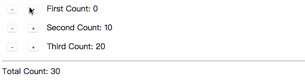
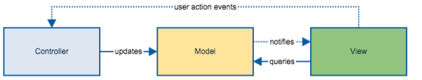
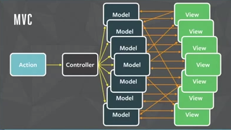
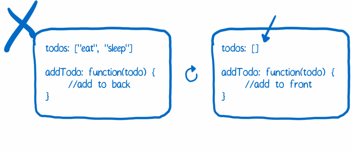
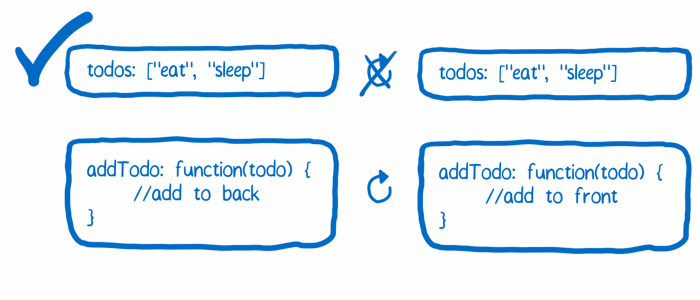
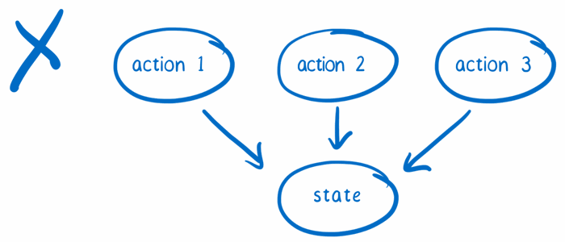
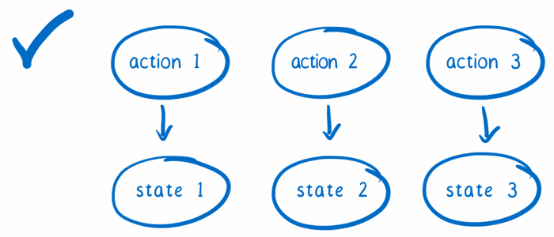
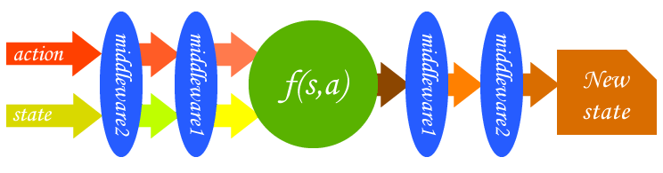

# 揭秘 React 状态管理

[原文地址](https://github.com/happylindz/react-state-management-tutorial)

请关注我的知乎专栏：[敲代码，学编程](https://zhuanlan.zhihu.com/learncoding)

我的博客：[Lindz's blog](https://github.com/happylindz/blog)

> 阅读本文之前，希望你掌握 React，ES6 等相关知识

如果觉得本文有帮助，可以点 star 鼓励下，本文所有代码都可以从 github 仓库下载，读者可以按照下述打开:

```
git clone https://github.com/happylindz/react-state-management-tutorial.git
cd react-state-management-tutorial
cd controlxxxx/
npm i 
npm start 
```

React 是 Facebook 提出的前端框架，作为 View 层很好地解决了视图层渲染问题，但是却缺乏有效的状态管理，在构建大型的前端应用就会显得十分乏力时，需要有一个良好的状态管理，如：Flux，Redux，Mobx 等等.

起初在使用的时候我也曾感到疑惑：为什么会有这么多东西，写起来不是更麻烦了吗，对其缺乏系统上的认知，以至于我在工作中用的蹩手蹩脚，最近有空认真地学习了一下其内在思想，希望能够帮助大家理解它们内在的含义。

本文将会介绍一下我对 React 状态管理方案的一些理解，并对 Flux, Rudux, Mobx 等等状态方案进行介绍以及使用。

全文将围绕一个例子 Counter 计数器为线索，并不断优化代码：



从图中可以看出，该例子包含三个计数器和一个总计数器，似乎很轻松，计数器为一个组件，总计数器为另一个组件，然后用一个容器包含三个计数器组件和一个总计数器组件即可。

有些经验是从看《深入浅出 React 和 Redux》这本书而来的，作者十分用心，写得挺不错的，有兴趣的可以买来看看：[深入浅出React和Redux](https://book.douban.com/subject/27033213/)

## 一、父子组件间通信

首先我们先用没有任何状态管理框架来做这个例子，由于总计数器组件的值需要结合三个计数器的值之和，形成联动的效果，根据下面的即可查看效果。

```
cd controlpanel/
npm i 
```

我们知道，父组件给子组件传递信息是通过 props 属性，而子组件给父组件传递信息是通过传递函数，

我把组件放在 view 中，目录结果如下：

```
├── index.js
└── views
    ├── ControlPanel.js
    ├── Counter.js
    └── Summary.js
```

主要代码：

```javascript
export default class ControlPanel extends Component {
    //...
    render() {
        return (
            <div>
                <Counter caption={ 'First' } value={ this.initValues['First'] } onCounterUpdate={ this.onCounterUpdate }   />
                <Counter caption={ 'Second' } value={ this.initValues['Second'] } onCounterUpdate={ this.onCounterUpdate }   />
                <Counter caption={ 'Third' } value={ this.initValues['Third'] } onCounterUpdate={ this.onCounterUpdate }   />
                <Summary value={ this.state.sum }  />
            </div>
        )
    }
}
```

1. 通过 props 向子组件传递信息，如 ``` caption, value ``` 等等字段。
2. 子组件通过父组件定义好的函数将信息放在函数参数中传递给父组件执行，如 ``` onCounterUpdate``` 字段。

值得注意的是，读者可能会好奇，为什么没有这样的 bind 代码？

```javascript
export default class ControlPanel extends Component {
    constructor(props) {
    	super(props)
    	this.onCounterUpdate = this.onCounterUpdate.bind(this)
    }
}
```

那是因为我在创建类方法的时候使用了箭头函数，在创建该方法的时候 this 已经绑定了类的上下文，所以不用再运行的时候再动态绑定，后面都是按照这种写法，不再赘述。

## 二、结合 MVC 管理

对于像我们这样简单的例子，可能这样就可以结束了，但是试想一下：

1. 对于大型的项目来说，这样的通信方式显然有点拙荆见肘，维护起来将会十分痛苦。
2. 这里刚好只是父子组件的通信，如果嵌套层次较深的组件通信通过这样的方式不够优雅。

所以我们自然而然地想到，可以将这些需要联动的数据抽离出来，形成全局 Model 层，通过一个 Controller 去控制，如下图：



**当计数器增减的时候，View 通知 Controller 更新 Model 数据，之后 Controller 通知所有监听该 Model 数据的 View 视图更新组件。**

```
cd controlpanel_with_mvc/
npm i 
npm start
```

重新改变下目录结构，将这三部分抽离

```
├── controller
│   └── index.js
├── index.js
├── model
│   └── index.js
└── views
    ├── ControlPanel.js
    ├── Counter.js
    └── Summary.js
```


Model 数据：

```javascript
export const counterData = {
    'First': 0,
    'Second': 10,
    'Third': 20,
}
```

Controller 代码：

```javascript
import { counterData } from '../model'

const events = []

const controller = {
    onChange: (callback) => {
        events.push(callback)
    },
    emitChange: () => {
        for(let i = 0; i < events.length; i++) {
            events[i]()
        }
    },
    setCounterValue: (caption, value) => {
        counterData[caption] = value
        controller.emitChange()
    },
    getCounterValue: caption => {
        return counterData[caption]
    },
    getTotalValues: () => {
        let total = 0
        for(let key in counterData) {
            if(counterData.hasOwnProperty(key)) {
                total += counterData[key]                
            }
        }
        return total
    },
}

export default controller
```

创建一个 eventHub，将监听数据的组件的回调函数传入到 events 中，更新输入则通过 controller.setCounterValue 方法，controller 更新数据后通过 emitChange 触发所有监听数据的函数，从而更新视图。

新的 Counter 组件：Counter 保存着全局 Model 数据与自己组件相关数据的映射，在 componentDidMount 执行时，将 onCounterUpdate 传入 events 队列中，即当数据发生变化时候同步保持局部数据与全局数据的一致性，从而形成联动效果。

```javascript
import controller from '../controller'
export default class Counter extends Component {
    //...
    onHandleClickChange = (isIncrement) => {
        const { caption } = this.props
        let value = isIncrement ? this.state.value + 1 : this.state.value - 1
        controller.setCounterValue(caption, value)
    }

    onCounterUpdate = () => {
        const { caption } = this.props
        this.setState({
            value: controller.getCounterValue(caption)
        })
    }
    
    componentDidMount() {
        controller.onChange(this.onCounterUpdate)
    }
}
```

现在父组件完成成为一个容器组件，数据与逻辑已经抽离出来了 View 层。

```javascript
import controller from '../controller'

export default class ControlPanel extends Component {
    render() {
        return (
            <div>
                {
                    controller.getDataKeys().map(caption => (<Counter key={ caption } caption={ caption } />))
                }
                <Summary />
            </div>
        )
    }
}
```

现在如果你想添加计数器只需要在 Model 层添加一个 ```Fourth: 30``` 字段即可。

MVC 的缺陷：上述的 MVC(View、Model、Controller 是1:1:1的关系)只是一种理想状态。现实中的程序往往是多视图，多模型。更严重的是视图与模型之间还可以是多对多的关系。也就是说，单个视图的数据可以来自多个模型，单个模型更新是需要通知多个视图，用户在视图上的操作可以对多个模型造成影响。

试想一下：当你再不经意间将数据设为 null 时，之前的数据将直接被你覆盖掉了，你没有对数据改变进行严格的控制。

```javascript
import controller from '../controller'
export default class Counter extends Component {
    //...
    onHandleClickChange = (isIncrement) => {
        const { caption } = this.props
        let value = isIncrement ? this.state.value + 1 : this.state.value - 1
        controller.setCounterValue(caption, null)
    }
}
```

另外，在实际框架实现中，总允许 View 和 Model 可以直接通信，当代吗量增大之后，我们的应用将会变得：



当出现多模型多视图，在 MVC 中让 View 和 Model 直接通信简直就是灾难。

## 三、Flux 架构

为此，Facebook 提出了 Flux 架构，提供更加严格的数据流控制，说白了就是让你无法直接修改数据，为所欲为了。


一个 Flux 应用包含四个部分：

* Dispatcher，处理动作的分发，修改 Store 上的数据
* Store，负责存储数据和处理数据相关的逻辑
* Action，驱动 Dipatcher 的 JS 对象
* VIew，视图部分，展示数据

可以看出，Action 是事先定义好的动作，比如：计数器增减操作，除此之外，用户无法通过其他方式直接对数据进行修改。当用户触发事件，通过 Dipatcher 将 Action 分发，Store 接收并处理 Action 对象，所以计数器例子我们就可以进行修改了。

```javascript
cd controlpanel_with_flux/
npm i 
npm start
```

目录结构：

```
├── actionCreator
│   └── index.js
├── actionTypes
│   └── index.js
├── dispatch
│   └── index.js
├── index.js
├── store
│   ├── CounterStore.js
│   └── SummaryStore.js
└── views
    ├── ControlPanel.js
    ├── Counter.js
    └── Summary.js
```

actionTypes 用于定义 Action 类型，通常暴露一下常量给组件使用，比如这里我们需要两个 Action 类型：增加、减少计数值。

```javascript
export const INCREMENT = 'INCREMENT'
export const DECREMENT = 'DECREMENT'
```

actionCreator 用于创建 action 函数，暴露出 Action 函数给组件使用，函数内分发 action 对象给 dispatcher 使用。

```javascript
import * as actionTypes from '../actionTypes'
import AppDispatcher from '../dispatch'

export default {
    increment: (counterCaption) => {
        AppDispatcher.dispatch({
            type: actionTypes.INCREMENT,
            counterCaption: counterCaption,
        })
    },
    decrement: (counterCaption) => {
        AppDispatcher.dispatch({
            type: actionTypes.DECREMENT,
            counterCaption: counterCaption,
        })
    }
}
```

store 取代了 Model 层以及部分 Controller 的逻辑，

```javascript
const counterData = {
    'First': 0,
    'Second': 10,
    'Third': 20,
}

const events = []

const CounterStore = {
    incrementCounter: caption => {
        counterData[caption]++
    },
    decrementCounter: caption => {
        counterData[caption]--
    },
    onChange: callback => {
        events.push(callback)
    },
    emitChange: () => {
        for(let i = 0; i < events.length; i++) {
            events[i]()
        }
    },
    getDataKeys: () => {
        return Object.keys(counterData)
    },
    getCounterValue: caption => {
        return counterData[caption]
    },
    getCounterKeys: () => {
        return Object.keys(counterData)
    },
}

export default CounterStore
```

这时候发送方和接收方都已经定义好了，就差 dispatcher 这个中间桥梁来传递数据了。

```javascript
import { Dispatcher } from 'flux'
import * as actionTypes from '../actionTypes'
import CounterStore from '../store/CounterStore'

const dispatcher = new Dispatcher()

CounterStore.dispatchToken = dispatcher.register((action) => {
    switch(action.type) {
        case actionTypes.INCREMENT:
            CounterStore.incrementCounter(action.counterCaption)
            CounterStore.emitChange()
            break
        case actionTypes.DECREMENT:
            CounterStore.decrementCounter(action.counterCaption)
            CounterStore.emitChange()
            break
        default:
            break
    }
})
```

通过 dispatcher.register 来出来视图发出的 action 对象，这时候 actionTypes 就派上用场，设置这种全局的变量可以减少一些硬编码量，减低犯错的可能。

从上述的代码可以看出，通过判断 action.type 值来进行不同的操作，但是能操作的可能只有增加或减少数值，其他类型的 action 均为无效操作，这样就限制了数据发生异常的可能。

当更新了数据后，同样触发监听数据的回调函数，让监听数据的组件将全局变量同步更新到局部的状态，从而触发视图的刷新，这部分逻辑就跟 MVC 上的一模一样了。

另外将原本的 controller 拆分成两个 Store (CounterStore & SummaryStore)，这样可以做更加细粒度的控制(即可以分开添加回调函数)，详细代码可以看 SummaryStore 和 dispatch，这里不再详细展开。

Flux 优点：

1. React 组价依然有自己的状态，但是已经完全沦为 Store 数据的一个映射，而不是主动变化数据
2. 对数据有着更加严格的控制，不允许直接对数据进行修改，数据更加不容易出错。
3. 遵循严格的单向数据流，想要追溯一个应用的逻辑变得非常容易，更加容易进行维护。

Flux 缺点：

参考：[《看漫画，学 Redux》 —— A cartoon intro to Redux](https://github.com/jasonslyvia/a-cartoon-intro-to-redux-cn)

1. store 的代码无法被热替换，除非清空当前的状态
2. 每次触发 action 时状态对象都被直接改写了
3. 没有合适的位置引入第三方插件
4. 难以进行服务端渲染

问题 1：Store 混淆了逻辑和状态，当我们需要动态替换一个 Store 的逻辑时，只能把这个 Store 整体替换掉，那也就无法保持 Store 中的存储状态。



在一个 store 中同时保存这两样东西将会导致代码热替换功能出现问题。当你热替换掉 store 的代码想要看看新的状态改变逻辑是否生效时，你就丢失了 store 中保存的当前状态。


#### 解决方案：

将这两样东西分开处理。让一个对象来保存状态，这个对象在热替换代码的时候不会受到影响。让另一个对象包含所有改变状态的逻辑，这个对象可以被热替换因为它不用关心任何保存状态相关的事情。



问题 2：时间旅行调试法的特性是：你能掌握状态对象的每一次变化，这样的话，你就能轻松的跳回到这个对象之前的某个状态（想象一个撤销功能）。



所以要想实现时间旅行特性，每一个状态改变的版本都需要保存在不同的 JavaScript 对象中，这样你才不会不小心改变了某个历史版本的状态。

#### 解决方案:

当一个 action 需要 store 响应时，不要直接修改 store 中的状态，而是将状态拷贝一份并在这份拷贝的状态上做出修改，这样方便对 store 状态进行调试回滚。



问题 3：没有合适的位置引入第三方插件

一个简单的例子就是日志。比如说你希望 console.log() 每一个触发的 action 同时 console.log() 这个 action 被响应完成后的状态。在 Flux 中，你只能订阅（subscribe） dispatcher 的更新和每一个 store 的变动。但是这样就侵入了业务代码，这样的日志功能不是一个第三方插件能够轻易实现的。

不好的：这样做就入侵了代码

```javascript
const dispatcher = new Dispatcher()

CounterStore.dispatchToken = dispatcher.register((action) => {
    console.log(action);
    switch(action.type) {
        //...
    }
})
```

我们希望以一种插件的方式来引入，比如：

```javascript
import logger from 'xxx-logger'
const dispatcher = new Dispatcher({ plugins:[ logger ] }) // something like this

CounterStore.dispatchToken = dispatcher.register((action) => {
    switch(action.type) {
        //...
    }
})
```

#### 解决方案:

在架构原有的功能基础之上添加了自己的功能。你可以把这种扩展点看做是一个增强器（enhancers）或者高阶对象（higher order objects），亦或者中间件（middleware）。



当 dispatch 获取到 action 和 state 之后，通过层层中间件处理，最后生成新的状态，可以将 logger 日志功能看成一个中间件。

## 四、基本 Redux 架构

基于上面存在的问题，Flux 基本原则是 “单向数据流”，Redux 可以理解为 Flux 的一种实现，其实有很多种 Flux 实现的框架，如：Reflux 等，但是 Reudx 有很多其他框架无法比拟的优势。

Redux 在单向数据流的基础上强调三个基础原理：

* 唯一数据源：即应用的状态数据应该只存在唯一一个 Store 上。整个应用只保持一个 Store，所有组件的数据源就是这个 Store 上的状态，每个组件往往只是用树形对象上的一部分数据。
* 保持状态只读。
* 数据改变只能通过纯函数完成。

为此，我们可以开始编写我们先编写一个基础的 Redux 实例，然后再想办法去改进它。

```
cd controlpanel_with_redux_basic/
npm i 
npm start
```

重新来看目录结构，会发现，少了 dispatch，多了 reducers

```
├── actionCreator
│   └── index.js
├── actionTypes
│   └── index.js
├── index.js
├── reducers
│   └── index.js
├── store
│   └── index.js
└── views
    ├── ControlPanel.js
    ├── Counter.js
    └── Summary.js
```

reducers 即处理 action 的纯函数，通过传入 action 对象以及旧的 state，返回新的 state。

```javascript
import * as actionTypes from '../actionTypes'

export default (state, action) => {
    const { counterCaption } = action
    switch(action.type) {
        case actionTypes.INCREMENT: 
            return { ...state, [counterCaption]: state[counterCaption] + 1 }
        case actionTypes.DECREMENT:
            return { ...state, [counterCaption]: state[counterCaption] - 1 }
        default:
            return { ...state }
    }
}
```

actionCreator 也有所变化，原本包含 dispatch 逻辑，现在只是简单返回一个 action js 对象。

```javascript
import * as actionTypes from '../actionTypes'

export default {
    increment: (caption) => {
        return {
            type: actionTypes.INCREMENT,
            counterCaption: caption,
        }
    },
    decrement: (caption) => {
        return {
            type: actionTypes.DECREMENT,
            counterCaption: caption,
        }
    },
}
```

store 的逻辑就很简单，只要传入初始化的数据和处理 Action 的纯函数即可。

```javascript
import { createStore } from 'redux'
import reducer from '../reducers'

const initValues = {
    'First': 0,
    'Second': 10,
    'Third': 20
}

const store = createStore(reducer, initValues)

export default store
```

在视图组件中，

1. 如果需要用到数据，则调用 store.getState 函数即可获取到当前数据
2. 如果需要修改数据，如添加或者减少数值，则仅需要调用 store.dispatch 分发 action，而不用像原来需要使用一整个 Dispatcher 对象
3. 一样的，在组件加载完成后，通过 store.subscribe 去订阅数据变化的回调函数，一旦数据发生了变化，则触发回调同步刷新局部变量

所以我们的视图就变成了这样：

```javascript
import store from '../store'
import actionCreator from '../actionCreator'

export default class Counter extends Component {
    // ...
    getOwnState() {
        return {
            value: store.getState()[this.props.caption]
        }
    }
    onHandleClickChange = (isIncrement) => {
        const { caption } = this.props
        if(isIncrement) {
            store.dispatch(actionCreator.increment(caption))
        }else {
            store.dispatch(actionCreator.decrement(caption))
        }
    }

    onCounterUpdate = () => {
        this.setState({
            ...this.getOwnState()
        })
    }
    
    componentDidMount() {
        store.subscribe(this.onCounterUpdate)
    }

    // ...
}
```

整个流程看来就像是：点击了增加按钮，通过 actionCreator.increment 返回一个 JS 对象，将它传递给 store.dispatch 分发出去，这时候交给 store 的 reducers 纯函数处理，通过 store.getState() 获取当前状态，以及 action 对象，返回一个新的 state，之后再调用 subscribe 的回调函数，将 store 上的变量映射同步更新到局部变量，局部变量通过 setState 即可更新视图。

Redux 解决了 Flux 所遗留下来的问题：

首先，数据和处理数据的逻辑(reducer)分离了，这样可以在做一些热替换的时候可以保留原本的状态不受影响。

其次，reducer 处理后返回一个新的 state，这样就有机会保存每次的状态，你可以跳回之前的某个状态，方便开发调试工具。

另外如果有多个 reducer 的话，每个 reducer 这变成了一个 store 上的局部变量，就像这样。

```javascript
import { createStore, combineReducers } from 'redux'
import reducerA from './reducers/reducerA'
import reducerB from './reducers/reducerB'
import reducerC from './reducers/reducerC'

const initValues = {
    'a': 0,
    'b': 10,
    'c': 20
}

const reducers = combineReducers({
    'a': reducerA,
    'b': reducerB,
    'c': reducerC,
})

const store = createStore(reducers, initValues)
export default store
```

值得注意的是：

1. reducerA 影响的 state 只是 store 上的一个局部状态，它并无法影响到 store 对象 b 或者 c 上的数据。
2. 当 store.dispatch 传递 action 对象过来后，store 无法智能地选择某些相关的 reducer 函数去执行，它只会傻瓜似地将所有 reducer 函数全部执行一遍，重新组装成一个完成的 store，哪怕只是修改一个简单的地方，但也要触发十几个 reducer 函数去做无用功。
3. 所以这时候 actionTypes 就起到作用了,因为 actionType 只是设置成字符串，如果字符串设置的过于简单就有可能导致重复，导致原本不相干的 reducer 处理了 action，这样应用就会陷入混乱当中，所以建议使用 Symbol 类型或者将字符串设置成比较具体复杂些的，比如想这样 ```export const increment = 'counter/increment'``` 添加不同的前缀来区分。
4. 同样的 store.subscribe 函数也不是智能地区分哪些数据变化，而是通通执行一遍返回新的值，即使大部分数据都没有发生变化。

另外中间件或者 store 增强器可以在创建 store 的时候进行传入，比如之前说的 logger 日志的功能。

```javascript
import { applyMiddleware, createStore } from 'redux';
import createLogger from 'redux-logger';
const logger = createLogger();

const initValue = {}

const store = createStore(
    reducer,
    initValue,
    applyMiddleware(logger),
);
```

默认它会判断第二个参数是不是函数，如果是函数，则当初是中间件集合进行传递，如果不是函数则当做是初始数据进行传递。

整个过程就像前面那幅图：


遵循中间件先进后出的原则，一一作用于 传入的 action 和 state 中，其实 reducer 函数可以看做是一个特殊的中间件，被 applyMiddleware 包裹在中间。通过中间件或者 store enhancer 可以定制我们的 store 功能，感兴趣的同学可以去网上学习，这里就不再展开。

## 五、改进后的 Redux 架构

前面 Redux 方案解决了 Flux 所遗留下来的一些问题，但是仅仅是这样的话它也存在一些问题，我们可以试着去改变它。

首先，这个 store 在每个需要数据的页面都需要引入，比如 Counter 和 Summary 组件，这样则显得不够优雅，如果可以将 store 变量挂载在 this 变量上，如果有需要的时候直接访问 this.xxx.store 即可访问到，那就更好了。

这里我们就需要提到一个 context，它可以帮助我们传递全局变量，比如在父组件里面的 this.context 挂载 store 变量，则稍微设置下即可在孙子组件里通过 this.context.store 获取到 store 变量，一般它是通过创建时候通过构造函数的第二参数传入的，如:```constructor(props, context)```，所以我们在写法上应该变成：

```javascript
// 错误的，无意间丢失了祖先组件传递的 context 变量
constructor(props) {
    super(props)
}

// 正确的
constructor() {
    super(...arguments)
}

// 或者 箭头函数无 arguments 参数
constructor = (...args) => {
    super(...args);
}
```

为此我们创建了一个包装组件 Provider，用于将 store 转化到 context 上。

```javascript
import { Component } from 'react'
import PropTypes from 'prop-types'

class Provider extends Component {

    getChildContext() {
        return {
            store: this.props.store
        }
    }

    render() {
        return this.props.children
    }

}

Provider.propTypes = {
    store: PropTypes.object.isRequired
}
Provider.childContextTypes = {
    store: PropTypes.object
}

export default Provider
```

这个组件做的唯一的是就是将 store 通过从传入的 props 中转化为 context 的属性，其它并没有任何修改，另外需要设置 ```Provider.childContextTypes```，否则可能无法生效。

```javascript
import React from 'react'
import { render } from 'react-dom'
import Provider from './Provider'
import ControlPanel from './views/ControlPanel'
import store from './store'

render(
    <Provider store={ store } >
        <ControlPanel />
    </Provider>,
    document.getElementById('root')
)
```

将 store 从根引入，传递给 Provider 对象，转化成 ```this.context``` 属性，以后需要用到 store 数据的只要引用 ```this.context``` 即可而不用再次引入 store 了。比如：Summary 组件

```javascript
class Summary extends Component {
    constructor() {
        super(...arguments)
        this.state = this.getOwnState()
    }
    getOwnState = () => {
        let total = 0
        const state = this.context.store.getState()
        for(let key in state) {
            if(state.hasOwnProperty(key)) {
                total += state[key]
            }
        }
        return {
            value: total
        }
    }
    // ...
}
// 别忘了设置 contextTypes，否则无法引用到 context
Summary.contextTypes = {
    store: PropTypes.object
}
```

另外一点是，我们将处理全局变量到局部变量的映射的逻辑跟视图组件耦合在了一起，不利于维护，我们应该将这其拆成两个部分：傻瓜组件和容器组件，

傻瓜组件即一个纯函数组件，没有 React 生命周期的事件，通过 props 传递的值进行对视图进行渲染，如：

```javascript
const Counter = (props) => {
    const { caption, onHandleClickChange, value } = props
    return (
        <div>
            <input style={ buttonStyle } type='button' value='-' onClick={ () => onHandleClickChange(false) } />
            <input style={ buttonStyle }  type='button' value='+' onClick={ () => onHandleClickChange(true) } />
            <span> { caption } Count: { value } </span>
        </div>
    )
}
```

任人摆布，别人传递什么值我就用什么值，而容器组件则将所有包含着全局变量到局部变量的映射的逻辑，有自己局部的 state，将自己局部的 state 转化为 props 传递给傻瓜组件进行渲染。

```javascript
class CounterContainer extends Component {
    // ...
    onCounterUpdate = () => {
        this.setState(this.getOwnState())
    }
    
    componentDidMount() {
        this.context.store.subscribe(this.onCounterUpdate)
    }
    
    render() {
        return (
            <Counter 
                caption={ this.props.caption }
                onHandleClickChange={ this.onHandleClickChange }
                value={ this.state.value }
             />
        )
    }
}
CounterContainer.contextTypes = {
    store: PropTypes.object
}
```

这样我们就将原本组件不同的部分给分离开来了，傻瓜组件仅专注于视图，容器专注处理数据同步的逻辑。改进后的 redux 例子可以通过：

```
cd controlpanel_with_redux_promoted/
npm i 
npm start
```

## 六、最终的 Redux 架构

我们发现容器的组件的逻辑其实都是一样的，无非就是两种，触发 action 的函数，以及全局变量映射到局部变量的 state，所以如果我们将这部分抽象出来的话那我们以后不是只要写傻瓜组件就行，而不用每次都还要重复写类似的容器组件。

```
cd controlpanel_with_redux_final/
npm i 
npm start
```

我们新增加一个 connect 目录，用于构件一个统一通用的容器组件，这里需要用到一些高阶组件的知识：高阶组件即函数接受一个 React 组件，返回一个增强后的 React 组件。

```javascript
// ...
export const connect = (mapStateToProps, mapDispatchToProps) => {
    // ...
    return (WrappedComponent) => {
        const HOCComponent = class extends Component {
            constructor() {
                super(...arguments)
                this.state = {};
            }
            onChange = () => {
                this.setState({})
            }
            componentDidMount() {
                this.context.store.subscribe(this.onChange)
            }
            render() {
                const store = this.context.store
                const stateToProps = mapStateToProps(store.getState(), this.props)
                const newProps = {
                    ...this.props,
                    ...stateToProps,
                    ...mapDispatchToProps(store.dispatch, this.props)
                }
                return <WrappedComponent  { ...newProps } />
            }
        }
        HOCComponent.contextTypes = {
            store: PropTypes.object
        }
        return HOCComponent;
    }
}
```

WrappedComponent 即传递的进来的傻瓜组件，connect 接受两个参数：状态映射以及函数映射。代码的核心在于 store.subscribe 了 onChange 函数，通过 ```setState({})``` 从而触发组件重新执行 render 函数进行 vdom 的比较，这时候 mapStateToProps 函数执行后返回的便是最新全局变量返回的局部映射，我们就将新的值通过 props 的方式传递给傻瓜组件，从而引起重新渲染。

```javascript
const Counter = ({ caption, value, increment, decrement }) => {
    console.log(caption)
    return (
        <div>
            <button style={ buttonStyle } onClick={ decrement }>-</button>
            <button style={ buttonStyle } onClick={ increment }>+</button>
             { caption } Count: { value }
        </div>
    )
}

const mapStateToProps = (state, ownProps) => {
    return {    
        caption: ownProps.caption,
        value: state[ownProps.caption]
    }
}

const mapDispatchToProps = (dispatch, ownProps) => {
    return {
        increment: () => {
            dispatch(actionCreator.increment(ownProps.caption))
        },
        decrement: () => {
            dispatch(actionCreator.decrement(ownProps.caption))
        }
    }
}

export default connect(mapStateToProps, mapDispatchToProps)(Counter);
```

以后我们的视图只需要写好纯渲染组件，以及 mapStateToProps 以及 mapDispatchToProps 对应的函数即可。值得注意的是：mapStateToProps 传入的参数分别为当前的 state 和 props，而 mapDispatchToProps 传递的是 dispatch 和 ownProps 对象。

这样还不算完，我们需要做一些性能优化，比如说：我们增加了 First 计时器的值，按理说只有 First 这个组件进行重新 render 了，而现在由于三个 setState({}) 都会触发高阶组件重新进行 render，有点浪费性能，所以这时候 ```shouldComponentUpdate``` 这个钩子函数派上用场，它是通过判断现在值得跟之前的是否有变化，如果没有变化，返回 false 后就不会执行后面 render 函数，如果有变化，则交给后面的 render 函数进行 vdom 比较了。

这里我通过创建一个全局的 Map 来存储之前的值。

```javascript
const map = new WeakMap()

export const connect = (mapStateToProps, mapDispatchToProps) => {
    return (WrappedComponent) => {
        const HOCComponent = class extends Component {
            shouldComponentUpdate(nextProps, nextState) {
                return map.get(this).value !== mapStateToProps(this.context.store.getState(), nextProps).value
            }
            render() {
                const store = this.context.store
                const stateToProps = mapStateToProps(store.getState(), this.props)
                const newProps = {
                    ...this.props,
                    ...stateToProps,
                    ...mapDispatchToProps(store.dispatch, this.props)
                }
                map.set(this, stateToProps)
                return <WrappedComponent  { ...newProps } />
            }
        }
    }
}
```

每次 render 时候就更新 Map 中对应该组件的值，然后下次执行更新的时候判断新值中的value 值是否跟之前存储的一样，如果一样说明没有发生变化，则返回 false 不再继续，比如更新 First 计数器，那么只有 First 的 value 更新了，其他的计数器值并没有变化，那么只有 First 组件执行了 render 函数，其他的计数器因为 shouldComponentUpdate 返回了 false 则不再执行 render 函数。

## 七、结合 React-Redux 

说了这么多，只是为了阐述一下它的演变的原理。这些其实在 react-redux 包里已经实现好了，我们不用每次在新的项目里再重新写一遍 Provider 或者 connect 这样的代码。

```
cd controlpanel_with_react_redux/
npm i 
npm start
```

区别在于：Provider、connect 都是由 react-redux 提供的

```javascript
import { Provider } from 'react-redux'
// ...
render(
    <Provider store={ store } >
        <ControlPanel />
    </Provider>,
    document.getElementById('root')
)
```

```javascript
import React from 'react'
import { connect } from 'react-redux'

// ...

export default connect(mapStateToProps)(Summary)
```

其它基本就一模一样了，自此 Redux 结合 React-Redux 的思想我已经介绍完了。

其实如果你一开始就使用 Redux + React-Redux 来编写代码的话肯定会觉得写起来很蹩脚，会很困惑为啥要这么设计，当你不明白其底层的含义的话就相当于是开始强行使用的话可能会适应的比较慢。希望读者在看完前面叙述的内容后能够对 Redux + React-Redux 存在的意义能够有一定的理解。

## 八、Mobx 架构

相比于 Redux 体系来说，Mobx 架构就比较容易理解和上手，如果大家使用过 Vue 的话相信对其双向绑定 MVVM 的思想并不陌生，React + Mobx 相当于是 Vue 全局作用域下的双向绑定，而 Vue 的状态管理框架 Vuex 却是借鉴了 Flux 架构，连尤大都说，似乎有点你中有我，我中有你的关系。

在 React 中，我们通过 setState 来更新数据，从而触发视图的更新，严格遵循着数据单向流的过程，但是如果你使用 Mobx 而不是用 setState 的话就可以将其变量双向绑定，就如官网上的例子：

```javascript
import {observer} from "mobx-react"
import {observable} from "mobx"

@observer 
class Timer extends React.Component {
    @observable secondsPassed = 0

    componentWillMount() {
        setInterval(() => {
            this.secondsPassed++
        }, 1000)
    }

    render() {
        return (<span>Seconds passed: { this.secondsPassed } </span> )
    }
})

React.render(<Timer />, document.body)
```

单向数据流或者双向数据流的好坏就见仁见智了，对双向数据绑定感兴趣的话可以看这篇文章:[剖析Vue实现原理 - 如何实现双向绑定mvvm](https://github.com/DMQ/mvvm)

下面我们重新修改之前的计时器的例子，结合 Mobx 架构来看看会有什么样的变化？

```
cd controlpanel_with_mobx/
npm i 
npm start
```
 
先来看一下目录结构:

```
├── index.js
├── store
│   ├── CounterStore
│   │   └── index.js
│   └── index.js
└── views
    ├── ControlPanel.js
    ├── Counter.js
    └── Summary.js
```

是不是发现简洁了许多，显然因为数据双向绑定了，当数据更新后不用写一大堆回调函数来更新视图了。

```javascript
import { observable, computed, action } from "mobx";

class CounterStore {
    @observable counters = {
        'First': 0,
        'Second': 10,
        'Third': 20,
    }
    @computed get totalValue() {
        let total = 0
        for(let key in this.counters) {
            if(this.counters.hasOwnProperty(key)) {
                total += this.counters[key]                
            }
        }
        return total
    }
    @computed get dataKeys() {
        return Object.keys(this.counters)
    }
    @action changeCounter = (caption, type) => {

        if(type === 'increment') {
            this.counters[caption]++            
        }else {
            this.counters[caption]--
        }
    }
}
const counterStore = new CounterStore()

export default counterStore
export { counterStore }
```

介绍几个概念：

1. observable：使数据变为可观测的，响应式的
2. computed: 计算属性，当依赖的数据发生变化时候，自动触发更新视图
3. action：一个函数，用于触发数据的更新，这里使用箭头函数可以静态地绑定 this，避免失去上下文。

一样的 store 需要从根组件向下注入：

```javascript
import React from 'react'
import { render } from 'react-dom'
import ControlPanel from './views/ControlPanel'
import * as stores from './store'
import { Provider } from 'mobx-react'

render(
    <Provider { ...stores }> 
        <ControlPanel />
    </Provider>,
    document.getElementById('root')
)
```

store 可以不只有一个，不同的 store 的数据以及对应处理数据的不同逻辑，当组件需要用某个 store 的时候需要通过 inject 注入。

```javascript
import React, { Component } from 'react'
import { observer, inject } from "mobx-react";

@inject('counterStore')
@observer
class Counter extends Component {

    render() {
        const store = this.props.counterStore
        const { caption } = this.props
        return (
            <div>
                <input style={ buttonStyle } type='button' value='-' onClick={ store.changeCounter.bind(this, caption, 'decrement') } />
                <input style={ buttonStyle }  type='button' value='+' onClick={ store.changeCounter.bind(this, caption, 'increment') } />
                <span> { caption } Count: { store.counters[caption] } </span>
            </div>
        )
    }
}
export default Counter
```

observer 代码这个类成为观察者，inject('counterStore') 注入 counterStore，可以通过 this.props.counterStore 来访问。是不是十分简单，使用起来也比较容易上手，相信使用过 Vue 写代码的人一定不会感到陌生。

值得一提的是 @ 这个代表 ES7 的装饰器，如果对其不熟悉的可以看这篇文章：[ES7 Decorator 装饰者模式](http://taobaofed.org/blog/2015/11/16/es7-decorator/)

自此 React 状态管理方案就介绍到这里，我们从传统的父子间通信，MVC 再到 Flux，Redux，最后止于 Mobx，希望本文能够对你有所帮助，觉得有用的话请点个 star 鼓励下，谢谢！